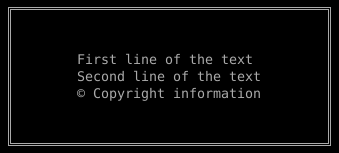
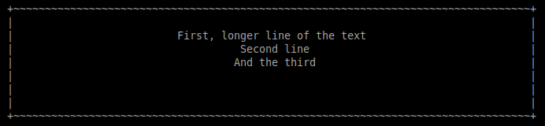

# About

PHP library for drawing a frame around lines of text. 

# Installation

## Requirements
To install this package you have to use `composer 2`.

## Install
```shell
composer require jakub-the-developer/php-frame
```

# Usage

```php
<?php
require './vendor/autoload.php';

use JakubTheDeveloper\PhpFrame\Frame;


$frame = new Frame(
    [
        "First line of the text",
        "Second line of the text",
        "© Copyright information",
    ]
);

echo $frame->draw();
```

# Examples

## Default configuration
```php

$frame = new \JakubTheDeveloper\PhpFrame\Frame(
    [
        "First line of the text",
        "Second line of the text",
        "© Copyright information",
    ]
);

echo $frame->draw();
```

Result:

```shell
╔═══════════════════════════════════════╗
║                                       ║
║                                       ║
║        First line of the text         ║
║        Second line of the text        ║
║        © Copyright information        ║
║                                       ║
║                                       ║
╚═══════════════════════════════════════╝
```

Screenshot:



## Custom configuration

```php
$configuration = new \JakubTheDeveloper\PhpFrame\FrameConfiguration(
    1, // top margin lines
    3, // bottom margin lines
    26, // margin left
    26, // margin right
    '+', // top-left corner symbol
    '+', // top-right corner symbol
    '+', // top-left corner symbol
    '+', // top-left corner symbol
    '~', // horizontal border symbol
    '|' // vertical border symbol
);

$frame = new \JakubTheDeveloper\PhpFrame\Frame(
    [
        "First, longer line of the text",
        "Second line",
        "And the third",
    ],
    $configuration
);
```

Result:

```shell
+~~~~~~~~~~~~~~~~~~~~~~~~~~~~~~~~~~~~~~~~~~~~~~~~~~~~~~~~~~~~~~~~~~~~~~~~~~~~~~~~~~+
|                                                                                  |
|                          First, longer line of the text                          |
|                                    Second line                                   |
|                                   And the third                                  |
|                                                                                  |
|                                                                                  |
|                                                                                  |
+~~~~~~~~~~~~~~~~~~~~~~~~~~~~~~~~~~~~~~~~~~~~~~~~~~~~~~~~~~~~~~~~~~~~~~~~~~~~~~~~~~+
```

Screenshot:


